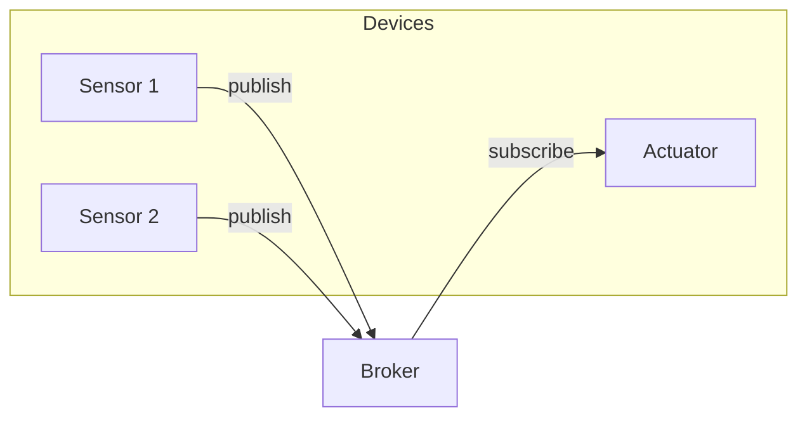
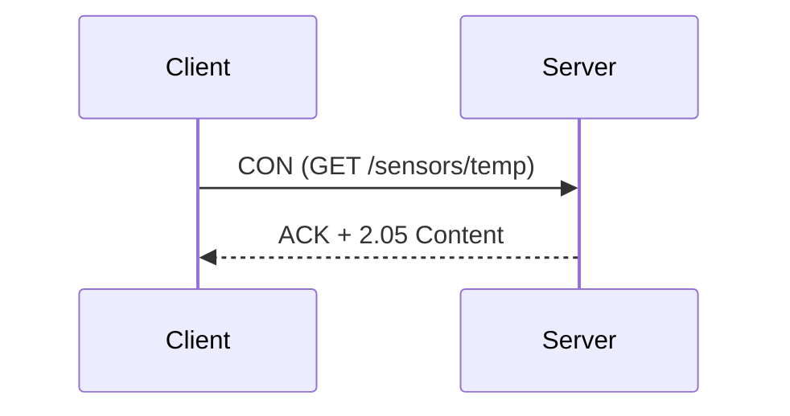

# Lezione: Protocolli di Rete per l'Internet delle Cose (IoT)

**Durata prevista:** 90 minuti

---

## 1. Introduzione alle Sfide di Rete nell'IoT

- **Limitazioni hardware**: memoria, CPU, batteria
- **Connettività intermittente**
- **Scalabilità**: migliaia di dispositivi
- **Sicurezza e privacy**
- **Interoperabilità** tra vendor

---

## 2. Specifiche dei Protocolli

### 2.1 MQTT (v3.1, v3.1.1, v5.0)
- Architettura publish/subscribe (broker centrale)
- QoS 0/1/2, retained messages, last‑will
- Leggero (header < 2 B) – ideale per dispositivi con banda ristretta
- **Diagramma** (Mermaid):


### 2.2 CoAP (Constrained Application Protocol)
- Basato su UDP, modello request/response
- Supporto per **Observe** (push notification) e **Blockwise transfer**
- Codifica binaria (CBOR) per ridurre overhead
- **Diagramma**:


### 2.3 AMQP (v0‑9‑1, 1.0)
- Messaging broker con code, routing exchange, pattern pub/sub, point‑to‑point
- Overhead più alto, usato in back‑end cloud
- Supporto transazionalità e conferme

### 2.4 Matter (precedentemente CHIP)
- Standard di connettività domestica basato su **Thread** e **Wi‑Fi**
- Sicurezza end‑to‑end con chiavi di attivazione
- Interoperabilità tra vendor (Apple, Google, Amazon)

### 2.5 Altri protocolli (breve)
- **HTTP/HTTPS** – interoperabilità universale, ma pesante
- **WebSocket** – comunicazione full‑duplex su TCP
- **LoRaWAN** – WAN a bassa potenza, 0.3–50 kbps, coverage km
- **NB‑IoT** – NB‑IoT su rete cellulare, grande scalabilità
- **Thread** – mesh IPv6 a bassa potenza, base per Matter
- **Zigbee** – mesh proprietario, 2.4 GHz, supportato da molti hub

---

## 3. Matrice Comparativa

| Caratteristica | MQTT | CoAP | AMQP | Matter | LoRaWAN | NB‑IoT |
|----------------|------|------|------|--------|----------|-------|
| Trasporto | TCP | UDP | TCP | Thread/Wi‑Fi | LoRa | LTE‑Cat‑NB |
| Overhead | Basso | Molto basso | Medio‑alto | Medio | Molto basso | Basso |
| QoS | 0‑2 | NON/CON | 0‑9 | - | - | - |
| Sicurezza | TLS | DTLS | TLS | TLS + attivazione | AES‑128 | EPS‑AKA |
| Tipologia | Pub/Sub | Req/Resp | Pub/Sub | Pub/Sub | Pub/Sub/Req | Req/Resp |
| Uso tipico | Telemetria | Sensori | Backend enterprise | Domotica | Agricoltura, smart city | Metering |

---

## 4. Linee Guida di Implementazione & Casi d'Uso

### 4.1 Scelta del protocollo
- **Telemetria continua, banda limitata** → MQTT o LoRaWAN
- **Controllo in tempo reale con risposta rapida** → CoAP (Observe) o MQTT QoS 1/2
- **Sistemi critici con transazioni** → AMQP
- **Domotica inter‑vendor** → Matter (Thread/Wi‑Fi)

### 4.2 Best practice
- Utilizzare **TLS/DTLS** per tutti i canali pubblici
- Configurare **keep‑alive** e **last‑will** in MQTT
- Limitare la dimensione dei payload (CBOR, MessagePack)
- Prediligere **topic hierarchy** ben strutturata
- Usare **gateway** per tradurre tra protocolli legacy e moderni

---

## 5. Esempi di Codice (Python)

### 5.1 MQTT (paho‑mqtt)
```python
import paho.mqtt.client as mqtt

broker = "test.mosquitto.org"
client = mqtt.Client()
client.tls_set()
client.connect(broker, 8883)

# Publish temperature ogni 10 s
import random, time
while True:
    temp = round(20 + random.random()*5, 2)
    client.publish("lab/sensor/temp", payload=str(temp), qos=1)
    time.sleep(10)
```

### 5.2 CoAP (aiocoap)
```python
import asyncio
from aiocoap import *

async def get_temp():
    protocol = await Context.create_client_context()
    request = Message(code=GET, uri="coap://[fd00::1]/temp")
    response = await protocol.request(request).response
    print('Temperatura:', response.payload.decode())

asyncio.run(get_temp())
```

---

## 6. Conclusioni
- Non esiste un *protocollo unico* per tutti i casi d'uso.
- La scelta dipende da **banda**, **latency**, **sicurezza**, **topologia** e **ecosistema**.
- Un'architettura ibrida (gateway che traduce) è spesso la soluzione più robusta per ambienti IoT eterogenei.

*Buona lezione!*