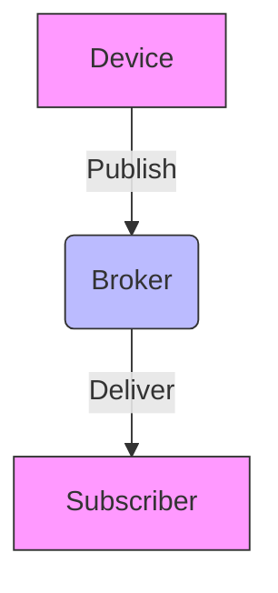
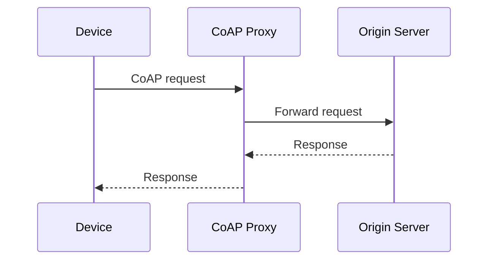
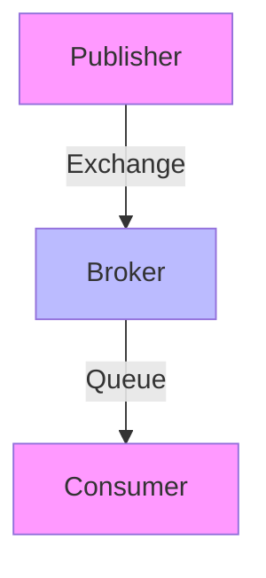

# Comprehensive IoT Networking Lecture for University

**Duration:** ~90 minutes  
**Target Audience:** University students (technical background)  
**Context:** Italian academic setting (Prof. Luca Bedogni)  

---

## 1. Introduction to IoT Networking Challenges (10 min)

- Heterogeneous devices & constraints (bandwidth, power, latency)
- Diversity of protocols & standards
- Interoperability challenges
- Security & reliability concerns

> **Key Takeaway:** IoT networking must balance efficiency, scalability, and flexibility across diverse deployments.

---

## 2. Protocol Overviews (45 min)

### 2.1 MQTT (Message Queuing Telemetry Transport)

- **Versions:** 3.1, 3.1.1, 5.0
- **QoS Levels:** 0 (at most once), 1 (at least once), 2 (exactly once)
- **Broker Architecture:** Centralized broker model
- **Use Cases:** Sensor data, telemetry, device control

**Mermaid Diagram - MQTT Broker Architecture**


### 2.2 CoAP (Constrained Application Protocol)

- **Based on:** RESTful HTTP semantics
- **Transport:** UDP (low overhead)
- **Features:** Observe pattern, block-wise transfers
- **Use Cases:** Low-power devices, constrained networks

**Mermaid Diagram - CoAP Interaction**


### 2.3 AMQP (Advanced Message Queuing Protocol)

- **Standard:** AMQP 0-9-1 (RabbitMQ)
- **Patterns:** Publish/Subscribe, Work Queues, Routing Keys
- **Reliability:** Transactions, acknowledgments
- **Use Cases:** Enterprise messaging, task queues

**Mermaid Diagram - AMQP Broker Model**


### 2.4 Matter (formerly CHIP)

- **Goal:** Unified application layer protocol
- **Transport:** Wi‑Fi, Thread, Ethernet
- **Features:** Secure, interoperable, device onboarding
- **Use Cases:** Smart home ecosystems

**Mermaid Diagram - Matter Ecosystem**


### 2.5 HTTP/HTTPS & WebSocket

- **HTTP:** Stateless request/response, widely used
- **HTTPS:** TLS encryption for security
- **WebSocket:** Full‑duplex communication, real‑time updates

**Mermaid Diagram - WebSocket Flow**
```mermaid
sequenceDiagram
    Client->>Server: HTTP Upgrade
    Server-->>Client: Switch to WebSocket
    Client<->>Server: Bidirectional messages
```

### 2.6 LoRaWAN, NB‑IoT, Thread, Zigbee

- **LoRaWAN:** Long‑range, low‑power, star topology
- **NB‑IoT:** Cellular‑based, high reliability
- **Thread:** IPv6‑based mesh, low‑power
- **Zigbee:** 2.4 GHz mesh, low‑rate

**Mermaid Diagram - LoRaWAN Network**


---

## 3. Comparative Analysis Matrix (10 min)

| Protocol | Transport | Typical Use | Strengths | Weaknesses |
|----------|-----------|-------------|-----------|------------|
| MQTT | TCP | Telemetry | QoS levels, lightweight | Broker single point |
| CoAP | UDP | Constrained devices | Low overhead, RESTful | UDP reliability |
| AMQP | TCP | Enterprise messaging | Reliability, routing | Complex setup |
| Matter | Wi‑Fi/Thread | Smart home | Unified, secure | New ecosystem |
| HTTP/HTTPS | TCP | Web APIs | Simple, mature | Higher overhead |
| WebSocket | TCP | Real‑time | Full‑duplex | Connection overhead |
| LoRaWAN | LoRa | Wide area | Long range, low power | Limited bandwidth |
| NB‑IoT | Cellular | Urban IoT | High reliability | Higher cost |
| Thread | IPv6 | Mesh IoT | Low power, mesh | Limited range |
| Zigbee | 2.4 GHz | Home automation | Mesh, low power | Interference |

---

## 4. Implementation Guidelines & Use Cases (10 min)

- **Choosing a protocol:** Match device capabilities, network infrastructure, latency needs.
- **Security considerations:** TLS, authentication, encryption at rest.
- **Scalability patterns:** Broker clusters, edge computing, hybrid approaches.
- **Tooling:** Mosquitto (MQTT), Eclipse (CoAP), RabbitMQ (AMQP), CHIP‑ compatible stacks.

---

## 5. Hands‑On Code Examples (15 min)

### 5.1 MQTT Publish/Subscribe (Python)

```python
import paho.mqtt.client as mqtt

def on_message(client, userdata, msg):
    print(f"Received: {msg.payload.decode()}")

client = mqtt.Client()
client.on_message = on_message
client.connect("broker.hivemq.com", 1883, 60)
client.subscribe("test/topic")
client.loop_forever()
```

### 5.2 CoAP Observe (using aiocoap)

```python
import asyncio
from aiocoap import Context, Message

async def observe():
    ctx = await Context.create_client()
    uri = "coap://example.com/sensor"
    obs = ctx.observe(uri, lambda msg: print(msg))  # Observe function
    await asyncio.Event().wait()  # Run forever

asyncio.run(observe())
```

### 5.3 AMQP Publish (Python)

```python
import pika

connection = pika.BlockingConnection(pika.ConnectionParameters('localhost'))
channel = connection.channel()
channel.queue_declare(queue='task_queue', durable=True)
channel.basic_publish(
    exchange='',
    routing_key='task_queue',
    body='Hello World!',
    properties=pika.BasicProperties(
        delivery_mode=2,  # make message persistent
    ))
connection.close()
```

*(Additional examples for Matter, LoRaWAN, NB‑IoT can be added as needed.)*

---

## 6. Conclusion & Q&A (5 min)

- Recap of protocol landscape
- Guidance on selecting appropriate stack
- Resources for deeper study (standards, open‑source implementations)

**End of Lecture**

---

*Prepared for Prof. Luca Bedogni – Italian academic context*  
*File location: /home/hermes/obsidian/toread/lecture_iot_networking.md*  
*Git repository: /home/hermes/lecture_repo*  
